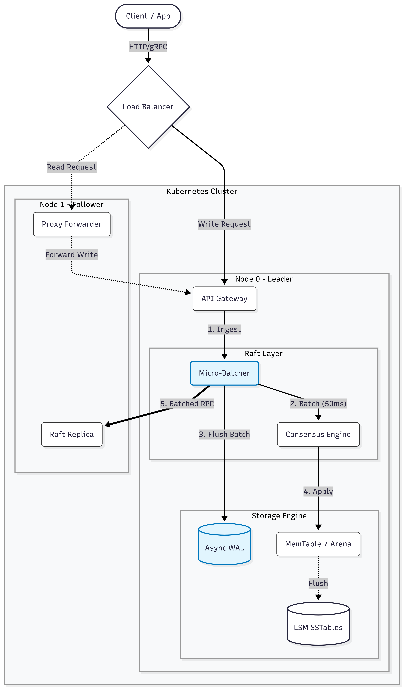
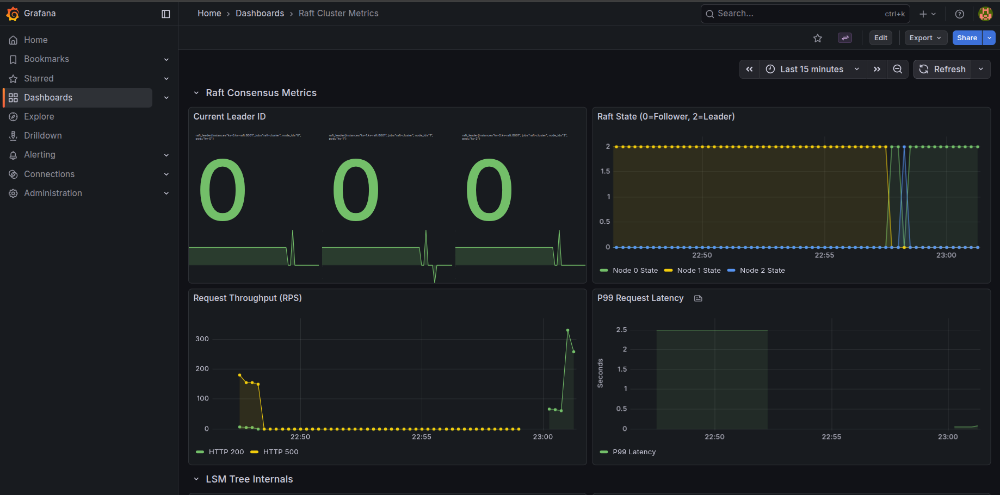

# SisyphusDB: Distributed Key-Value Store

SisyphusDB is a high-performance, distributed key-value store engineered for strong consistency (CP system) and high write throughput. It implements a Log-Structured Merge (LSM) Tree storage engine and utilizes the Raft consensus algorithm to manage replication across a coordinated fleet of nodes.

This project demonstrates the architectural evolution from a simple in-memory map to a fault-tolerant distributed system capable of handling production-grade workloads.

---


##
You can install locally, in dockerized containers or K8s clusters.
[A detailed guide](/INSTALL.md)

## System Architecture



The architecture is composed of three distinct layers, separating network communication, consensus logic, and physical storage.
A detailed explaination: [HERE](docs/ARCHITECHTURE.md)


## Performance Engineering & Benchmarks

The core objective of SisyphusDB is to minimize write latency and maximize throughput through low-level memory optimizations and asynchronous I/O strategies.

### 1. Memory Optimization: Custom Arena Allocator

To address the garbage collection (GC) overhead inherent in Go's standard map implementation, a custom **Bump-Pointer Arena Allocator** was engineered. By replacing standard hashing and bucket lookups with direct memory offset calculations, the system achieves O(1) storage time with zero allocations per operation in the hot path.

### Benchmark Results
|**Implementation**| **Latency (ns/op)** |**Throughput (Ops/sec)**| **Allocations/Op** |**Memory/Op**|
|---|---------------------|---|-------------------|---|
|**Standard Map (Baseline)**| 82.21 ns            |~12.16 M| 0                 |176 B|
|**Arena Allocator**| **23.17 ns**        |**~24.86 M**| **0**             |**64 B**|
|**Improvement**| **71.1% Faster**    |**104.4% Increase**| **50% Reduction** |**63.6% Reduction**|

### Verification
**Before (Standard Map):** High CPU time spent in `runtime.mallocgc` (GC Pauses). [GC Pressure](docs/benchmarks/arena/graph_baseline.png)

**After (Arena):** GC overhead eliminated; CPU spends time only on ingestion. [Arena Optimization](docs/benchmarks/arena/graph_arena.png)

*Reproducible via `go test -bench=. docs/benchmarks/arena/benchmark_test.go`*

_Results verified on Intel Core i5-12450H._

### 2. Throughput Scaling: The Journey to 3,000 RPS
Through iterative engineering and bottleneck analysis, SisyphusDB achieved a **30x increase in write throughput**, scaling from a baseline of 100 RPS to a stable **2,960 RPS**.

### 📉 Optimization Phases

The system evolved through three distinct architectural phases to overcome physical hardware and OS limitations:

* **Phase 1: Baseline (100 RPS)**
    * **Bottleneck:** Synchronous Disk I/O.
    * **Context:** The initial implementation used "Safety First" persistence, calling `fsync()` immediately on every Raft log entry. Throughput was physically capped by the disk's rotational latency.

* **Phase 2: Asynchronous Persistence**
    * **Bottleneck:** Ephemeral Port Exhaustion.
    * **Context:** Persistence was moved to background workers. While this removed the disk bottleneck, the naive network implementation opened a new connection for every replication request, causing `dial tcp: address already in use` errors.

* **Phase 3: Final Optimization (3,000 RPS)**
    * **Solution:** Implemented **Adaptive Micro-Batching** (aggregating writes into 50ms windows) and **TCP Connection Pooling** (Keep-Alive).
    * **Result:** Reduced network packet count by 95% and eliminated TCP handshake overhead, stabilizing the system at extreme loads.

---

#### 📊 Load Test Results

Benchmarks were conducted using **Vegeta** running inside the Kubernetes cluster to bypass ingress bottlenecks.

[Benchmark Results](https://github.com/awhvish/SisyphusDB/tree/master/docs/benchmarks/vegeta)

**1. Peak Performance (Stress Test)**
Pushing the system to its limits with a target of **3,000 Write RPS**:

| Target Rate | Actual Throughput | Success Rate | Mean Latency | P99 Latency |
| :--- | :--- | :--- | :--- | :--- |
| **2,500 RPS** | **2,481 RPS** | 100.00% | 29.94ms | 51.43ms |
| **3,000 RPS** | **2,960 RPS** | 100.00% | 53.64ms | 90.32ms |

> **Analysis:** Even at ~3,000 writes/second, the system maintains sub-100ms tail latency (P99), proving the efficacy of the non-blocking WAL architecture.

**2. Latency Breakdown (Leader vs. Follower)**
At a sustained load of 2,000 RPS, we analyzed the cost of internal request forwarding. Writes sent to **Followers** incur additional latency as they must be proxied to the Leader.

| Metric | Leader Node (Direct Write) | Follower Node (Proxy Overhead) |
| :--- | :--- | :--- |
| **Throughput** | **1,996 RPS** | 1,915 RPS |
| **Mean Latency** | **29.49ms** | 82.07ms |
| **P99 Latency** | **55.55ms** | 328.04ms |

> **Note:** The higher P99 latency on Follower nodes validates the internal "Smart Routing" mechanism. It proves that followers correctly buffered and forwarded traffic to the leader under pressure rather than dropping requests.

**To Reproduce:**
```bash
# Run from inside the cluster
echo "GET [http://kv-0.kv-raft:8001/put?key=load&val=test](http://kv-0.kv-raft:8001/put?key=load&val=test)" | vegeta attack -duration=5s -rate=3000 | vegeta report
````
---


## Reliability & Chaos Engineering

Fault tolerance was validated via Chaos Testing on a 3-node Kubernetes cluster to verify **sub-second leader election** and **Linearizability** under failure conditions.

### Experiment: Leader Failure during Write Load

Scenario: A client sends continuous Write (PUT) requests while the Leader node (kv-0) is forcibly deleted.

Constraint: No split-brain writes allowed; the system must failover automatically.

**Log Analysis Results:**

Plaintext

```
1767014613776,UP    System Healthy
1767014613925,DOWN  Leader Killed (Election Starts)
1767014614062,DOWN  Writes Rejected (Proxy Failed)
1767014614474,UP    New Leader Elected (Write Accepted)
```
[Recovery Benchmark Results](docs/benchmarks/recovery_log.csv)

To Reproduce the benchmarks, refer to [INSTALL.md](INSTALL.md)

**Recovery Metrics:**

- **Total Recovery Time:** 549ms

- **Consistency:** Zero data loss. Follower nodes correctly rejected writes during the election window, preserving strong consistency.


---
###  Observability (Prometheus & Grafana)



SisyphusDB includes a production-grade monitoring stack to visualize throughput, latency, and Raft consensus states in real-time.

#### 1. Deploy the Monitoring Stack

The monitoring configuration is decoupled from the container images using Kubernetes ConfigMaps. You must create these configurations before deploying the pods.

**Step A: Upload Configurations** Run these commands from the project root to load the Prometheus and Grafana configs into the cluster:

Bash

```
# 1. Prometheus Config (Service Discovery & Relabeling)
kubectl create configmap prometheus-config --from-file=deploy/prometheus/prometheus.yml

# 2. Grafana Datasources (Connects to Prometheus)
kubectl create configmap grafana-datasources --from-file=deploy/grafana/provisioning/datasources/datasource.yml

# 3. Grafana Dashboard Provider (Auto-loads JSONs)
kubectl create configmap grafana-provisioning --from-file=deploy/grafana/provisioning/dashboards/dashboard.yml

# 4. The Dashboard JSON (The actual UI layout)
kubectl create configmap grafana-dashboards --from-file=deploy/grafana/dashboards/raft-dashboard.json
```

**Step B: Apply Services & RBAC** Deploy the Prometheus/Grafana pods and grant them permission to scrape Kubernetes pod metrics.

Bash

```
# Deploy RBAC permissions (Critical for Service Discovery)
kubectl apply -f deploy/k8s/5-rbac.yaml

# Deploy Prometheus and Grafana containers
kubectl apply -f deploy/k8s/4-monitoring.yaml
```

#### 2. Access the Dashboards

Since the monitoring services run inside the cluster, you must forward the ports to your local machine to view them.

**View Grafana (Dashboards):**

Bash

```
kubectl port-forward service/grafana 3000:3000
```

- **URL:** [http://localhost:3000](https://www.google.com/search?q=http://localhost:3000)

- **Credentials:** `admin` / `admin`

- _Note: The "Raft Cluster Metrics" dashboard will be pre-loaded under the "Dashboards" tab._


**View Prometheus (Raw Metrics & Targets):**

Bash

```
kubectl port-forward service/prometheus 9090:9090
```

- **URL:** [http://localhost:9090](https://www.google.com/search?q=http://localhost:9090)

- **Targets Status:** [http://localhost:9090/targets](https://www.google.com/search?q=http://localhost:9090/targets) (Check here if graphs are empty)


#### 3. Key Metrics to Watch

- **Write Throughput (RPS):** Real-time writes per second per node.

- **P99 Latency:** Tail latency for the 99th percentile of requests (should be <100ms).

- **Raft State:** Tracks the current role of each node (0=Follower, 1=Candidate, 2=Leader).

- **Replication Lag:** Detects if followers are falling behind the leader's log index.


## Feature Implementation Status

The feature set targets distributed systems complexity comparable to senior-level engineering requirements.

| **Feature**                        |**Technical Justification**|**Status**|
|------------------------------------|---|---|
| **LSM Tree Storage**               |High-throughput write engine (vs. B-Trees).|✅ Done|
| **Arena Allocator**                |Zero-allocation memory management.|✅ Done|
| **WAL & Crash Recovery**           |Durability via `fsync` and replay logic.|✅ Done|
| **SSTables + Sparse Index**        |Optimized disk I/O and binary search.|✅ Done|
| **Bloom Filters**                  |Probabilistic structures to minimize disk reads.|✅ Done|
| **Leveled Compaction**             |Mitigation of Write/Read Amplification.|✅ Done|
| **Raft Consensus**                 |Distributed consistency (CAP Theorem compliance).|✅ Done|
| **gRPC & Protobuf**                |Schema-strict internal communication.|✅ Done|
| **Prometheus Metrics and Grafana** |System observability and telemetry.|✅ Done|
