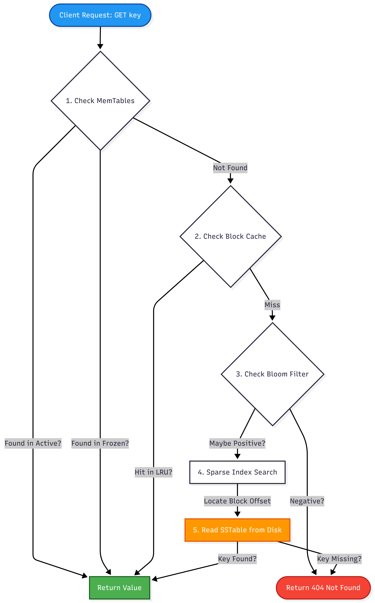

# SisyphusDB: System Architecture & Design

This document details the architectural decisions, internal data flows, consistency models, and the engineering roadmap of SisyphusDB. The system is designed as a coordinated fleet, transforming a simple KV store into a distributed system compliant with the CAP theorem (CP system).

## 1. High-Level System Architecture

The final system consists of a cluster of nodes (typically 3 or 5) functioning as a coordinated fleet. The architecture is composed of three distinct layers, separating network communication, consensus logic, and physical storage.

### Layer 1: The API & Network Layer (Entry Point)

- **gRPC Interface:** Replaces simple HTTP/TCP. Uses Protocol Buffers for strict schemas and high-performance serialization.

- **Custom Protocol (RESP):** (Optional) Implementation of the Redis Serialization Protocol, allowing the database to interface with standard Redis clients.

### Layer 2: The Distribution Layer (The "Brain")

- **Consistent Hashing:** Routes keys to specific nodes based on `hash(key) % num_nodes`. This ensures balanced data distribution (e.g., in a 100GB cluster with 5 nodes, each node handles ~20GB).

- **Raft Consensus Module:** The core coordination engine managing replication.

    - **Leader Election:** Automatically detects failures and elects a new leader if the current one crashes.

    - **Log Replication:** Ensures that if Node A writes data, Node B and Node C confirm it before the system reports "Success" to the user.

### Layer 3: The Storage Layer (The "Muscle")

- **LSM Tree Engine:** The storage pipeline consisting of `MemTable` $\to$ `WAL` $\to$ `SSTable`.

- **Block Cache:** An in-memory LRU cache storing uncompressed data blocks to accelerate read performance.

- **Compactor:** A background process that merges old SSTables (e.g., Level 0 $\to$ Level 1) to reclaim space and solve write/read amplification.

---

## 2. The Data Flow ("Life of a Request")

The following narratives describe how the finished architecture handles requests, ensuring data integrity and performance.

### The Write Path (PUT)

**Scenario:** User sends `PUT key: "user:1", val: "Avis"`

1. **Routing:** The client hashes "user:1", determines it belongs to **Shard 1**, and sends a gRPC request to the **Raft Leader** of Shard 1.

2. **Consensus (Raft):**

    - The Leader appends the command to its **Raft Log** (distinct from the Storage WAL).

    - The Leader broadcasts the entry to all Followers.

    - Followers persist the entry and return an Acknowledgment (ACK).

3. **Commit:** Once a Majority (Quorum) of ACKs is received, the Leader marks the entry as **Committed**.

4. **Execution:** The Leader applies the committed entry to its local **LSM Tree** (MemTable/WAL).

5. **Response:** The Leader replies "OK" to the client.

### The Read Path (GET)

**Scenario:** User sends `GET key: "user:1"`

1. **Routing:** Client sends request to the Leader (for Strong Consistency) or a Follower (for Eventual Consistency).

2. **MemTable Check:** The node checks the active and immutable (frozen) MemTables in RAM.

3. **Block Cache Check:** The node checks the LRU Block Cache for recently accessed data blocks.

4. **Bloom Filter:** The node queries SSTable Bloom Filters to ask: _"Is this key definitely NOT here?"_ This prevents expensive disk seeks for non-existent keys.

5. **SSTable Search:** If necessary, the node performs a Sparse Index Binary Search on the disk-resident SSTables.

6. **Response:** The value "Avis" is returned.

---

## 3. The "Parallel Worlds" Model (Consistency Internals)

To achieve **Linearizability** (Strict Consistency) without blocking the internal Raft loop, the system runs two completely decoupled processes. Go Channels are used to bridge these worlds.

### The Two Worlds

1. **The Front Desk (The `Put` Function):** Handles the impatient client waiting for a receipt.

2. **The Back Office (The `readAppliedLogs` Loop):** Processes immutable orders coming from headquarters (Raft).

### The Channels

- **`applyChan` (Raft $\to$ Store):** The **Conveyor Belt**. It delivers **Committed** data. Once a command appears here, it is "Set in Stone" and cannot be changed. The cluster has agreed on it.

- **`notifyChan` (Store $\to$ Client):** The **Parking Spot**. Created for a specific request, used once to wake up the blocked client, and then destroyed.

### The "Grand Loop" (Linearization Workflow)

This flow guarantees that "Success" means "Saved on multiple nodes."

1. **Proposal:** Client calls `Put()`. The Store asks Raft to start the process and receives a future Log Index (e.g., 100).

2. **Wait:** The Store creates a `notifyChan`, maps it to Index 100 (`notifyChans[100] = ch`), and **BLOCKS** execution. The client is now frozen.

3. **Consensus:** The Raft Leader replicates the log. Upon Quorum, it pushes the command for Index 100 into `applyChan`.

4. **Execution:** The background loop (`readAppliedLogs`) wakes up, pulls the command from `applyChan`, and writes it to the MemTable.

5. **Notification:** The background loop checks `notifyChans`, finds the channel for Index 100, and sends "Success".

6. **Response:** The `Put()` function unblocks and returns to the client.

---

## 4. High Availability: Smart Routing with Fallback

SisyphusDB employs a production-grade routing strategy to ensure **Zero-Downtime Failovers**.

### The Problem

When a Leader crashes, Raft elects a new one in **<600ms**. However, Kubernetes Readiness Probes may take **5-10 seconds** to detect the failure, update the Endpoints API, and propagate changes to `kube-proxy`. During this window, traffic is still sent to the dead/wrong node.

### The Solution

1. **Primary (Happy Path):** Kubernetes Service routes traffic directly to the Leader via Readiness Probes. This ensures single-hop latency.

2. **Fallback (Failover Window):** If a Follower receives a write request (because K8s hasn't updated yet), it does **not** fail the request.

3. **Proxying:** The Follower identifies the new Leader via Raft internal state and **proxies** the request to it.

**Result:** The client sees a successful write even while the cluster is converging, masking the network topology change.

---

## 5. Detailed Feature Breakdown

The feature set targets a "Senior Engineer" level of distributed systems complexity.

|**Feature**|**Justification ("Senior" Level)**|**Status**|
|---|---|---|
|**LSM Tree Storage**|Understanding of write-heavy storage engines vs. B-Trees.|✅ Done|
|**WAL & Crash Recovery**|Knowledge of durability, `fsync`, and file system integrity.|✅ Done|
|**SSTables + Sparse Index**|Optimization of disk I/O and binary search algorithms.|✅ Done|
|**Bloom Filters**|Probabilistic structures to prevent expensive disk reads.|✅ Done|
|**Leveled Compaction**|Solving Write/Read Amplification problems.|✅ Done|
|**Raft Consensus**|Implementation of distributed consistency (CAP Theorem).|✅ Done|
|**gRPC & Protobuf**|Industry standard for microservices communication.|✅ Done|
|**Prometheus Metrics**|Observability ("Building runnable production systems").|✅ Done|
|**Snapshotting**|State compression for fast node recovery/joining.|⭕ Future|

---

## 6. Implementation Roadmap

The development of SisyphusDB follows a phased approach to manage complexity.

- **Phase 1: Robust Local Storage (The Engine)**

    - Build the LSM Tree, WAL, and SSTable reader.

    - Implement Bloom Filters and Compaction.

- **Phase 2: The Network Layer (The Chassis)**

    - Wrap the Store in a gRPC Server.

    - Define Protocol Buffers services (`Put`, `Get`).

- **Phase 3: The Consensus Layer (The Boss Fight)**

    - Implement Raft (Leader Election, Log Replication).

    - Connect Raft to the FSM (Finite State Machine).

- **Phase 4: Sharding (The Scale)**

    - Implement a Gateway/Coordinator.

    - Route requests via Consistent Hashing.